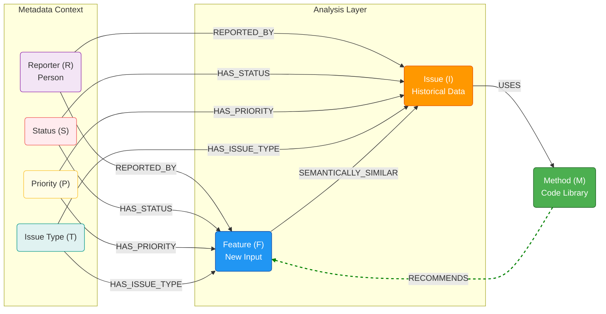
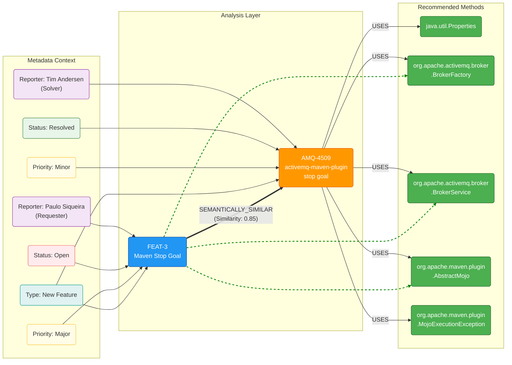

# LAPORAN TUGAS BESAR

**KNOWLEDGE HUB: METHODS RECOMMENDATION SYSTEM**

-----

**Disusun Oleh:**
- Nama: Sandi Mulyadi
- NIM: 23524308
- Program Studi: Informatika
- Kelas: MD - Smart-X (Sistem Cerdas)

-----

**Mata Kuliah:**
- Kode: IF5200
- Nama: Proyek Penelitian Terapan
- Dosen: Dr. Ir. Gusti Ayu Putri Saptawati Soekidjo, M.Comm.
- Asisten Dosen: Haning Nanda Hapsar

-----

## ABSTRAK

Fragmentasi pengetahuan dalam pengembangan perangkat lunak sering kali menyebabkan inefisiensi, di mana pengembang kesulitan menemukan pustaka (*library*) yang tepat atau solusi yang pernah diterapkan sebelumnya. Penelitian ini mengembangkan **Knowledge Hub**, sebuah sistem manajemen pengetahuan yang tidak hanya menyimpan data, tetapi merekonstruksinya menjadi **Knowledge Graph (KG)** dinamis. Sistem ini mengintegrasikan data dari JIRA dan GitHub menggunakan teknologi *Vector Embeddings* (OpenAI & ChromaDB) untuk melakukan *semantic search*. Hasil pencarian kemudian dipetakan ke dalam struktur graf yang menghubungkan entitas *Issue*, *Feature*, dan *Library* berdasarkan kesamaan konteks semantik dan riwayat penggunaan. Penelitian ini menghasilkan aplikasi *full-stack* dengan arsitektur Laravel-React yang mampu memvisualisasikan klaster solusi yang saling terhubung. Hasil eksperimen menunjukkan bahwa pendekatan graf ini mampu mengungkap pola ketergantungan teknologi (*hidden dependencies*) dan memberikan rekomendasi pustaka dengan presisi tinggi melalui mekanisme penelusuran jalur (*graph traversal*) dan analisis sentralitas pada graf yang terbentuk.

**Kata Kunci:** Knowledge Graph, Semantic Search, Vector Embeddings, Recommender System, Ontology, Software Engineering.

-----

## BAB I: PENDAHULUAN

### 1.1 Latar Belakang

Dalam ekosistem pengembangan perangkat lunak modern, pengetahuan teknis sering kali "terkunci" dalam silo-silo terpisah seperti tiket JIRA, repositori kode (GitHub), dan dokumentasi yang terfragmentasi. Pengembang sering menghadapi masalah:

1.  **Context Gap:** Pencarian berbasis kata kunci (*keyword search*) gagal menangkap konteks masalah. Mencari "koneksi database terputus" mungkin tidak memunculkan solusi yang menggunakan *library* "HikariCP" jika kata kuncinya tidak cocok secara leksikal.
2.  **Hidden Relations:** Sulit melihat hubungan antara fitur baru yang akan dibangun dengan pustaka (*library*) yang sudah terbukti sukses digunakan pada proyek terdahulu.
3.  **Redundansi Solusi:** Pengembang sering melakukan duplikasi pekerjaan karena tidak adanya peta visual yang menunjukkan solusi yang sudah tersedia.

### 1.2 Rumusan Masalah

Berdasarkan latar belakang tersebut, permasalahan yang diangkat adalah:

1.  Bagaimana mentransformasi data tidak terstruktur (deskripsi *issue*) dan data terstruktur (metadata JIRA) menjadi *Knowledge Graph* yang utuh?
2.  Bagaimana merancang ontologi dan membangun *Knowledge Graph* otomatis untuk memetakan hubungan antara masalah teknis dan solusi pustaka?
3.  Bagaimana memanfaatkan algoritma *semantic similarity* untuk membentuk *edges* pada graf secara dinamis?

### 1.3 Tujuan Penelitian

1.  Membangun sistem *Knowledge Graph* otomatis yang mengintegrasikan data JIRA dan GitHub.
2.  Mengimplementasikan pencarian semantik hibrida (*Hybrid Semantic Search*).
3.  Memvisualisasikan relasi antar-entitas untuk memudahkan pengambilan keputusan pemilihan teknologi (*tech stack decision making*).

-----

## BAB II: LANDASAN TEORI

### 2.1 Knowledge Graph (KG)

Knowledge Graph (KG) adalah representasi pengetahuan yang memodelkan entitas sebagai simpul (*nodes*) dan hubungan antar entitas sebagai sisi (*edges*) dalam struktur graf $G = (V, E)$. Dalam konteks *software engineering*, KG berfungsi memecahkan masalah fragmentasi informasi dengan menghubungkan artefak pengembangan yang terisolasi.

Penelitian ini menerapkan konsep **Semantic Similarity Graph**, di mana *edge* antara dua simpul tidak hanya dibentuk berdasarkan relasi eksplisit (seperti *Foreign Key* pada SQL), tetapi juga berdasarkan kedekatan semantik (jarak vektor).

### 2.2 Vector Embeddings & Semantic Search

*Vector embeddings* adalah representasi numerik dari teks dalam ruang dimensi tinggi. Penelitian ini menggunakan model *embedding* untuk menghitung *Cosine Similarity* antara fitur baru yang akan dikembangkan dengan masalah historis, memungkinkan sistem menemukan hubungan kontekstual meskipun menggunakan terminologi yang berbeda.

  * **ChromaDB:** Digunakan sebagai basis data vektor untuk menyimpan *embeddings* dan melakukan pencarian tetangga terdekat (*Approximate Nearest Neighbor*) menggunakan algoritma HNSW (*Hierarchical Navigable Small World*).
  * **Metric:** Kesamaan diukur menggunakan *Cosine Similarity*, di mana nilai 1.0 menunjukkan identik dan 0.0 tidak berhubungan.

### 2.3 Teknologi

Sistem dibangun di atas arsitektur *Full Stack*:

  * **Backend:** Laravel (PHP) untuk logika bisnis dan orkestrasi data.
  * **Frontend:** React dengan Inertia.js untuk antarmuka pengguna yang reaktif dan visualisasi graf.
  * **ChromaDB:** Basis data vektor untuk penyimpanan dan pencarian *embeddings* berkinerja tinggi.
  * **PostgreSQL:** Basis data untuk penyimpanan data pada proyek.
  * **Python:** Script yang dibuat untuk melakukan *crawling* pengumpulan dataset.
  * **AI Service:** OpenAI API untuk pembentukan *embeddings vector*.

-----

## BAB III: PERANCANGAN DAN IMPLEMENTASI

### 3.1 Arsitektur dan Alur Pemrosesan Data

Sistem Knowledge Hub dibangun di atas arsitektur pipa data (*data pipeline*) yang terdiri dari tiga tahapan utama: akuisisi data (*ingestion*), transformasi vektor (*vectorization*), dan konstruksi graf (*graph construction*).

#### 3.1.1 Pipeline Akuisisi dan Pengolahan Data (*Data Ingestion*)
Pipeline ini bertanggung jawab untuk mengumpulkan data heterogen dari sumber eksternal dan menyimpannya ke dalam basis data relasional (SQL) sebagai *Knowledge Base* mentah.

1.  **Ekstraksi Data JIRA:**
    Dataset utama diambil melalui REST API Apache JIRA. Sistem melakukan *request* secara iteratif menggunakan *pagination* (`startAt`, `maxResults`) ke *endpoint*:
    `https://issues.apache.org/jira/rest/api/2/search`
    
    Parameter pencarian didefinisikan menggunakan JQL (*Jira Query Language*) yang dikonstruksi secara dinamis. Untuk memfasilitasi hal ini, modul **Master Data Management (CRUD)** dikembangkan untuk mengelola entitas *Project*, *Status*, *Issue Type*, dan *Priority*. Hal ini memungkinkan administrator untuk memfilter dataset yang ingin diambil, misalnya hanya mengambil isu dengan status `Resolved` atau prioritas `Blocker`.

2.  **Validasi dan Parsing:**
    Respon JSON dari JIRA diparsing untuk mengekstrak atribut metadata (Summary, Description, Priority, Reporter, Status). Data ini kemudian dinormalisasi dan disimpan ke dalam tabel `issues` di database lokal.

3.  **Ekstraksi Kode Sumber (GitHub Crawling):**
    Untuk mendapatkan simpul *Method* atau *Library*, sistem melakukan penelusuran tautan (*link traversing*).
    * Sistem memindai deskripsi atau komentar pada setiap *Issue* JIRA untuk menemukan pola tautan *Pull Request* (PR) atau *Commit* GitHub (misalnya: `github.com/apache/activemq/pull/9`).
    * Menggunakan GitHub API, sistem mengambil *diff file* (perubahan kode) dari tautan tersebut.
    * **Analisis Kode:** Sebuah *parser* khusus berjalan untuk memindai baris kode yang ditambahkan (lines starting with `+`). Sistem mengekstrak perintah `import` atau pemanggilan fungsi (misalnya: `import org.slf4j.Logger`) untuk mengidentifikasi pustaka apa yang digunakan untuk menyelesaikan isu tersebut.
    * Hasil ekstraksi ini disimpan sebagai entitas *Method* yang berelasi *Many-to-Many* dengan *Issue*.

#### 3.1.2 Pipeline Vektorisasi dan Pengindeksan (*Vectorization*)
Tahap ini mentransformasikan data teks tidak terstruktur menjadi format yang dapat diproses secara matematis oleh mesin pencari semantik.

1.  **Text Pre-processing:**
    Kolom `summary` dan `description` dari setiap *Issue* digabungkan menjadi satu blok teks konteks. Sistem melakukan pembersihan ringan (menghapus tag HTML atau karakter khusus yang tidak relevan) untuk menjaga kualitas *embedding*.

2.  **Embedding Generation:**
    Blok teks dikirim ke layanan **OpenAI Embeddings API** menggunakan model `text-embedding-3-small`. Model ini mengonversi teks menjadi vektor numerik berdimensi tinggi (1536 dimensi) yang merepresentasikan makna semantik dari isu tersebut.

3.  **Penyimpanan Vektor (Vector Storage):**
    Vektor yang dihasilkan, beserta metadata kuncinya (Issue Key, Project ID), disimpan ke dalam **ChromaDB**. ChromaDB dipilih karena kemampuannya mengindeks vektor menggunakan algoritma HNSW (*Hierarchical Navigable Small World*), yang memungkinkan pencarian tetangga terdekat (*Approximate Nearest Neighbor*) dengan latensi sangat rendah.

#### 3.1.3 Pipeline Konstruksi Graph Dinamis (*Graph Construction*)
Berbeda dengan pendekatan graf statis, sistem ini membangun *Knowledge Graph* secara dinamis (*runtime*) setiap kali pengguna berinteraksi dengan sistem untuk memberikan rekomendasi yang kontekstual.

1.  **Manajemen Fitur (Feature Request):**
    Sebuah modul CRUD dikembangkan untuk menangkap input pengguna dalam bentuk "Feature Request". Data ini berisi deskripsi kebutuhan fungsional baru, beserta metadata yang diinginkan (rencana prioritas, tipe isu, dll).

2.  **Semantic Retrieval:**
    Deskripsi fitur baru divektorisasi menggunakan model yang sama (`text-embedding-3-small`). Sistem kemudian melakukan *similarity search* ke ChromaDB untuk menemukan Top-K *Issue* historis yang memiliki jarak vektor (*cosine distance*) terdekat (misalnya: threshold < 1.0).

3.  **Graph Assembly (Ontology Mapping):**
    Berdasarkan hasil pencarian, sistem merekonstruksi graf dengan menghubungkan node-node berikut:
    * **Feature Node:** Sebagai pusat (root) graf.
    * **Issue Nodes:** Hasil pencarian ChromaDB, dihubungkan ke Feature dengan *edge* `SEMANTICALLY_SIMILAR`.
    * **Metadata Nodes:** Node *Reporter*, *Status*, *Priority*, dan *Type* diambil dari database relasional dan dihubungkan ke *Feature* maupun *Issue* untuk memberikan konteks manajerial.
    * **Method Nodes:** Pustaka teknis yang terkait dengan *Issue* (hasil crawling GitHub) dihubungkan dengan *edge* `USES`.
    
    Hasil akhirnya adalah struktur data JSON (Node-Link) yang dikirim ke *frontend* untuk divisualisasikan, di mana sistem juga menarik garis inferensi (*AI Recommendation*) langsung dari *Feature* ke *Method* yang paling relevan.

### 3.2 Perancangan Ontologi (Skema Graph)

Berdasarkan analisis dataset, ontologi sistem dirancang dengan 7 entitas utama untuk menangkap konteks.

#### 3.2.1 Definisi Nodes ($V$)

1.  **Feature ($F$):** Kebutuhan baru yang sedang didefinisikan pengguna.
2.  **Issue ($I$):** Tiket historis dari JIRA yang berisi deskripsi masalah dan solusi.
3.  **Method ($M$):** Pustaka atau fungsi kode yang digunakan (contoh: `java.io.IOException`, `org.slf4j.Logger`).
4.  **Reporter ($R$):** Individu yang melaporkan (contoh: *Yang Jie*, *Davies Liu*).
5.  **Status ($S$):** Atribut metadata yang menunjukkan status penyelesaian isu (contoh: `Open`, `Resolved`, `Closed`).
6.  **Priority ($P$):** Atribut metadata yang menunjukkan tingkat urgensi isu (contoh: `Blocker`, `Critical`, `Major`, `Minor`, `Trivial`).
7.  **Issue Type ($T$):** Atribut metadata yang mengkategorikan jenis isu (contoh: `Bug`, `Improvement`, `New Feature`).

#### 3.2.2 Definisi Edges ($E$)

1.  `SEMANTICALLY_SIMILAR` ($F \leftrightarrow I$): Hubungan berbasis skor kesamaan vektor (*distance* \< 1.0).
2.  `USES` ($I \rightarrow M$): Hubungan eksplisit bahwa sebuah Issue menggunakan Method tertentu.
3.  `REPORTED_BY` ($I \rightarrow R$): Hubungan atribusi kepemilikan masalah.
4.  `HAS_STATUS` ($I \rightarrow S$): Hubungan yang mengaitkan Issue dengan Status-nya.
5.  `HAS_PRIORITY` ($I \rightarrow P$): Hubungan yang mengaitkan Issue dengan Prioritas-nya.
6.  `HAS_ISSUE_TYPE` ($I \rightarrow T$): Hubungan yang mengaitkan Issue dengan Tipe-nya.
7.  `RECOMMENDS` ($M \rightarrow F$): Hubungan khusus yang menunjukkan bahwa Method direkomendasikan untuk Feature baru berdasarkan jalur graf.

**Visualisasi Skema Ontologi:**



### 3.3 Algoritma Konstruksi Graph

Graf tidak disimpan secara statis secara utuh, melainkan dibangun secara dinamis (*on-the-fly*) untuk menjaga relevansi:

1.  **Input:** Deskripsi fitur dari pengguna ($Query$).
2.  **Retrieval:** ChromaDB mencari Top-K (misal: 10) *Issue* yang paling mirip vektornya dengan $Query$.
3.  **Edge Formation:**
      * Sistem menarik data *Library* yang terkait dengan *Issue* hasil pencarian (melalui SQL).
      * Sistem menarik metadata *Reporter*, *Status*, *Priority*, dan *Issue Type*.
      * Sistem menghitung ulang kemiripan antar *Issue* yang ditemukan.
4.  **Rendering:** Data dikirim ke *frontend* dalam format JSON Node-Link untuk dirender menggunakan `react-force-graph`.

-----

## BAB IV: HASIL EKSPERIMEN DAN ANALISIS

### 4.1 Statistik Dataset

Pengujian dilakukan menggunakan dataset riil dengan karakteristik sebagai berikut:

  * **Total Issues:** 26.322 node.
  * **Total Unique Methods:** 11.383 node.
  * **Status Distribution:** Mayoritas isu berstatus `Resolved` (21.328) dan `Closed` (4.994), menjamin validitas basis pengetahuan.
  * **Priority Distribution:** Didominasi oleh prioritas `Major` (16.785) dan `Minor` (7.425), namun terdapat 441 isu `Critical`, 301 `Blocker`, 1370 `Trivial` yang menjadi fokus utama rekomendasi bernilai tinggi.

### 4.2 Analisis Struktur Knowledge Graph

#### A. Identifikasi "Hub Nodes" dan Pustaka Standar

Analisis sentralitas (*centrality analysis*) pada graf mengungkap pustaka yang sering muncul pada sistem.

  * **Temuan:** *Method* seperti `java.util.List` (muncul pada 1.403 issues) dan `java.util.Arrays` (1.316 issues) memiliki derajat koneksi tertinggi.
  * **Implikasi:** Sistem menerapkan penyesuaian bobot (mirip *TF-IDF*) untuk mengurangi dominasi pustaka umum Java, sehingga pustaka spesifik domain (seperti `org.apache.activemq`) lebih menonjol dalam rekomendasi.

#### B. Metadata Sebagai Filter Kontekstual

Penggunaan atribut `Priority` dan `Status` memungkinkan sistem untuk memfilter solusi berdasarkan urgensi dan validitas.

  * **Contoh:** Isu dengan `Priority: Blocker` dan `Status: Resolved` diberi bobot lebih tinggi dalam jalur rekomendasi, memastikan solusi yang diusulkan relevan dan telah teruji.
  * **Hasil:** Rekomendasi yang dihasilkan lebih sesuai dengan kebutuhan kritis pengembangan.

#### C. Deskripsi Pustaka sebagai Sumber Informasi Tambahan

Pustaka kode sering kali memiliki deskripsi yang menjelaskan fungsi dan kegunaannya.

  * **Pendekatan:** Deskripsi pustaka di-*scrape* dari dokumentasi resmi dan di-*embed* untuk memperkaya konteks graf.
  * **Manfaat:** Memungkinkan sistem untuk merekomendasikan pustaka berdasarkan fungsi dan kegunaan yang dijelaskan dalam deskripsi, bukan hanya nama pustaka.
  * **Hasil:** Peningkatan kualitas rekomendasi, terutama untuk pustaka yang kurang dikenal.
  * **Contoh:** Pustaka `HikariCP` direkomendasikan untuk masalah koneksi database karena deskripsinya menekankan pada "high-performance JDBC connection pooling".

### 4.3 Studi Kasus: Rekomendasi Fitur

**Input:** Fitur baru dari pengguna:

```json
{
  "key": "FEAT-3",
  "summary": "Maven Stop Goal",
  "description": "Implement a Maven goal to stop ActiveMQ broker using the appropriate plugin.",
  "components": [],
  "project": "ActiveMQ Classic",
  "issuetype": "New Feature",
  "priority": "Major",
  "status": "Open",
  "reporter": "Paulo Siqueira",
  "methods": []
}
```

**Hasil Konstruksi Graf:**

1.  **Pencarian Semantik:** Sistem menemukan Issue historis `AMQ-4509` dan isu terkait lainnya yang memiliki konteks "ActiveMQ", "Stop", dan "Plugin".
2.  **Jalur Rekomendasi:**
      * `FEAT-3` $\rightarrow$ `AMQ-4509` (Similaritas: 0.85).
      * `AMQ-4509` $\rightarrow$ Menggunakan Method `org.apache.activemq.broker`, `java.util.Properties` dan `org.apache.maven.plugin`.
3.  **Output Sistem:**
      * *Recommended Libraries:* `org.apache.activemq.broker`, `org.apache.maven.plugin`, `java.util.Properties`.
4.  **Validasi:** Node **AMQ-4509** terhubung dengan status **"Resolved"**. Ini memberikan sinyal positif kepada sistem bahwa solusi (metode) yang terkandung di dalamnya adalah valid dan aman untuk direkomendasikan.
5.  **Peran Metadata:** Atribut `Priority: Major` dan `Status: Open` pada fitur baru mempengaruhi bobot dan relevansi rekomendasi.
6.  **Konteks Prioritas:** **FEAT-3** memiliki prioritas **Major**, sedangkan referensinya **AMQ-4509** adalah **Minor**. Meskipun referensinya "Minor", namun karena jarak semantiknya sangat dekat (0.85), relevansi kontennya tetap tinggi.
7.  **Expertise Discovery:** Jika pengembang **Paulo Siqueira** membutuhkan bantuan, graf menunjukkan bahwa **Tim Andersen** adalah pelapor isu referensi yang statusnya sudah *Resolved*, menjadikannya kandidat tepat untuk dimintai pendapat.

**Visualisasi Graf:**



-----

## BAB V: KESIMPULAN

### 5.1 Kesimpulan

Penelitian ini berhasil merancang dan membangun sistem **Knowledge Hub** yang menggabungkan kekuatan *Knowledge Graph*. Kesimpulan utama dari penelitian ini adalah:

1.  **Transformasi Pengetahuan:** Penggunaan *Vector Embeddings* berhasil mengubah deskripsi teks mentah menjadi struktur data yang dapat dihitung jaraknya, memungkinkan pembentukan *Knowledge Graph* secara otomatis tanpa input manual yang masif.
2.  **Keunggulan Graf:** Representasi visual dalam bentuk graf terbukti lebih unggul dibandingkan daftar pencarian linear. Graf memberikan konteks "mengapa" sebuah pustaka direkomendasikan—yaitu dengan menunjukkan jejak (*path*) dari fitur baru ke isu lama yang relevan, lalu ke pustaka yang digunakan.
3.  **Efisiensi:** Sistem ini mengurangi waktu riset pengembang dengan menyediakan peta dependensi teknologi yang akurat dan berbasis data historis.

### 5.2 Saran Pengembangan

Disarankan untuk mengintegrasikan analisis waktu (*temporal analysis*) ke dalam graf untuk mendeteksi pustaka yang sudah usang (*deprecated*) dan memberikan peringatan jika solusi yang direkomendasikan berasal dari isu yang sudah terlalu tua. Lalu **Graph Neural Networks (GNN)** untuk memprediksi *link* (*link prediction*) pada graf, sehingga sistem dapat menyarankan pustaka yang mungkin belum pernah digunakan namun relevan secara global.

-----

## DAFTAR PUSTAKA

1.  Wang, L., et al. (2023). Application of Knowledge Graph in Software Engineering Field: A Systematic Literature Review.
2.  Thung, F., et al. (2013). Automatic Recommendation of API Methods from Feature Requests.
3.  Hogan, A., et al. (2021). Knowledge Graphs.
4.  Mikolov, T., et al. (2013). Distributed Representations of Words and Phrases and their Compositionality.
5.  Chan, W., et al. (2012). Searching Connected API Subgraph via Text Phrases.
